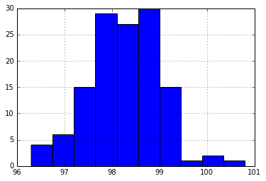

```python
import pandas as pd
from scipy import stats
import numpy as np
%matplotlib inline
```


```python
df = pd.read_csv('human_body_temperature.csv')
```


    130


```python
temperatures = df['temperature']
temperatures.hist()
```


    <matplotlib.axes._subplots.AxesSubplot at 0x19677dc9048>





The sample is approximately normal. The sample size is large enough to estimate the population standard deviation with the sample standard deviation. A z-test is appropriate to determine if the true population mean is 98.6 degrees Fahrenheit. A t-test should give approximately the same results. The alternative hypothesis is that the population mean is not 98.6 degrees, so a two-tailed test is appropriate.


```python
sample_mean = temperatures.mean()
sample_std = temperatures.std()
sample_size = len(df)
sample_mean,sample_std,sample_size
```


    (98.24923076923078, 0.7331831580389454, 130)


```python
z = (sample_mean-98.6)/(sample_std/np.sqrt(sample_size))
p = 2*stats.norm.cdf(z)
z,p
```


    (-5.4548232923640789, 4.9021570141133797e-08)


```python
stats.ttest_1samp(temperatures,98.6)
```


    Ttest_1sampResult(statistic=-5.4548232923645195, pvalue=2.4106320415561276e-07)


We are extremely unlikely to find a sample mean this large by taking a random sample. The t-test showed similar results.


```python
se = sample_std/np.sqrt(sample_size)
se
```


    0.06430441683789101


The standard error of the mean is 0.06 degrees Fahrenheit.


```python
zradius_95 = stats.norm.ppf(.975)
tradius_95 = stats.t.ppf(.975,sample_size-1)
zradius_95,tradius_95
```


    (1.959963984540054, 1.9785244914586051)


```python
z_ci = [sample_mean-zradius_95*se,sample_mean+zradius_95*se]
z_ci
```


    [98.123196428181657, 98.375265110279898]


```python
t_ci = [sample_mean-tradius_95*se,sample_mean+tradius_95*se]
t_ci
```


    [98.122002905608042, 98.376458632853513]


These are the 95% confidence intervals for the population mean. The difference between the interval determined from a z-test and that determined from a t-test is insignificant, though the t-test determined a broader interval, as expected. 

These do not correspond to what are considered the "normal" boundaries for an individual's temperature. To find an interval for "normal" temperature, we need to apply the z radius to our model of the population distribution.


```python
normal = [sample_mean-zradius_95*sample_std,sample_mean+zradius_95*sample_std]
normal
```


    [96.812218185403111, 99.686243353058444]


A temperature below 96.8 or above 99.7 could be considered "abnormal".


```python
temp_male = df[df['gender']=='M']['temperature']
temp_female = df[df['gender']=='F']['temperature']
```


```python
mmean = temp_male.mean()
fmean = temp_female.mean()
mstd = temp_male.std()
fstd = temp_female.std()
mmean,mstd,fmean,fstd
```


    (98.1046153846154, 0.6987557623265908, 98.39384615384613, 0.7434877527313665)


```python
z = (mmean-fmean)/np.sqrt((mstd**2/len(temp_male))+(fstd**2/len(temp_female)))
p = 2*stats.norm.cdf(z)
z,p
```


    (-2.2854345381652741, 0.02228736076067726)


```python
stats.ttest_ind(temp_male,temp_female,equal_var=False)
```


    Ttest_indResult(statistic=-2.2854345381656112, pvalue=0.023938264182934196)


We are unlikely to find a difference between the means this large by taking a random sample. The t-test showed similar results. There is a significant difference between the male and female mean temperatures.


```python

```
